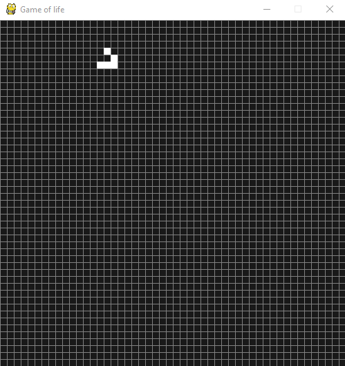

# Game of life

<p align='center'>

</p>

The Game of Life, also known simply as Life, is a cellular automaton devised by the British mathematician John Horton
Conway in 1970. It is a zero-player game, meaning that its evolution is determined by its initial state, requiring no 
further input. The idea is to interact with the Game of Life by creating an initial configuration and observing how it
evolves.

## Prerequisites
* Python3
* Pygame
* Numpy python package

## Getting Started with python 3 installed
1. Clone this repo:
```sh
git clone https://github.com/andresjjn/Game_of_life.git
cd Game_of_life
```
2. Install [Pygame](https://www.pygame.org/wiki/GettingStarted).

3. Change permissions of Life.py
```sh
chmod u+x Life.py
```
4. Change permissions of Life.py
```sh
chmod u+x Life.py
```
5. Execute
```sh
python3 ./Life.py
```
## RULES
**1.** Any live cell with fewer than two live neighbours dies, as if by underpopulation.

**2.** Any live cell with two or three live neighbours lives on to the next generation.

**3.** Any live cell with more than three live neighbours dies, as if by overpopulation.

**4.** Any dead cell with exactly three live neighbours becomes a live cell, as if by reproduction.

## How to play
Pause or play = Press any Key.

Draw = Pause with any key and click on the square. Press any
       key to continue the simulation.|
       
## Contributing
Pull requests are welcome. For important changes, please open an issue to discuss the change you would like to improve.

## License
[MIT](https://choosealicense.com/licenses/mit/)
